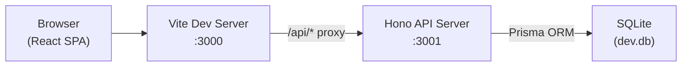
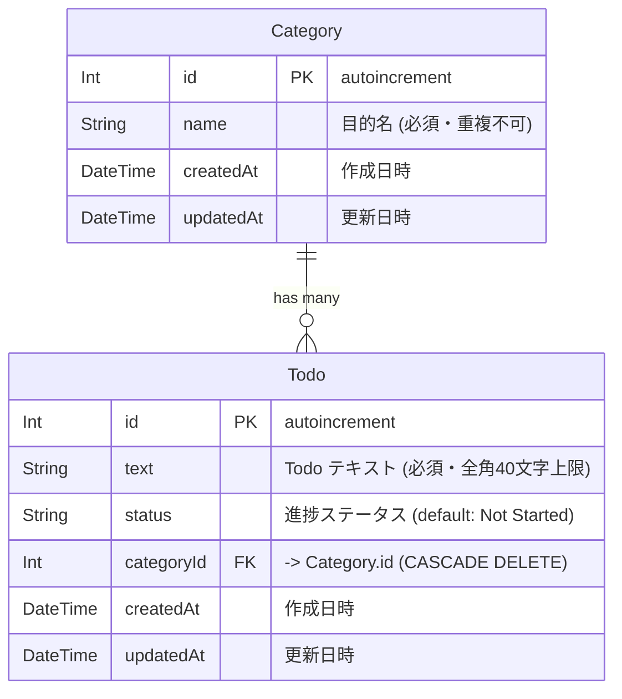

# 設計書

> 実装方針 (フレームワーク選定 / データモデル / API 設計 / 主要コンポーネント構造 等) を記録する。
> 各章の判断根拠は `docs/adr/` の ADR に切り出し, 本書は「現在の状態」を表す。

## 1. アーキテクチャ概要

SPA + REST API のクライアント-サーバ構成。localhost で完結する。



| レイヤ | 技術 | 参照 ADR |
|--------|------|----------|
| フロントエンド | React 19 + Vite 6 + TypeScript | [ADR-0002](adr/0002-tech-stack.md) |
| バックエンド | Hono + Node.js | 同上 |
| ORM | Prisma | 同上 |
| データベース | SQLite (ファイルベース) | 同上 |

---

## 2. データモデル

### 2-1. ER 図



### 2-2. エンティティ説明

#### Category (目的)

US-002, US-003 で定義された「目的」。Todo をグルーピングする親エンティティ。

| カラム | 型 | 制約 | 説明 |
|--------|------|------|------|
| id | Int | PK, autoincrement | 一意識別子 |
| name | String | NOT NULL | 目的名。画面のリストボックスに表示 |
| createdAt | DateTime | NOT NULL, default: now() | レコード作成日時 |
| updatedAt | DateTime | NOT NULL, auto-update | レコード更新日時 |

- Category を削除すると、紐づく Todo も **Cascade 削除** される (US-003)。
- 画面上では `_count.todos` で紐づく Todo 件数を表示する。

#### Todo

US-004, US-005, US-006 で定義された Todo 項目。

| カラム | 型 | 制約 | 説明 |
|--------|------|------|------|
| id | Int | PK, autoincrement | 一意識別子 |
| text | String | NOT NULL | Todo 本文。全角 40 文字上限 (US-004) |
| status | String | NOT NULL, default: `"Not Started"` | 進捗ステータス (下表参照) |
| categoryId | Int | FK → Category.id, NOT NULL | 所属する目的 |
| createdAt | DateTime | NOT NULL, default: now() | 登録日時 (RegistDate として表示) |
| updatedAt | DateTime | NOT NULL, auto-update | 更新日時 (UpdateDate として表示) |

#### 進捗ステータス (status 列の取りうる値)

US-006 に基づき、アプリケーションコードで以下の 4 値に制限する (DB 上は String)。

| DB 値 | 表示ラベル | 意味 |
|-------|------------|------|
| `Not Started` | Not Started (未着手) | 初期値。新規作成時に自動設定 |
| `In Progress` | In Progress (進行中) | 作業中 |
| `Pending` | Pending (保留) | 一時停止 |
| `Done` | Done (完了) | 完了済み。編集・削除は引き続き可能 |

### 2-3. Prisma スキーマとの対応

一次正 (実装上の定義): `backend/prisma/schema.prisma`

本セクションの ER 図は Prisma スキーマと同期させる。スキーマ変更時は本書も更新すること。

### 2-4. 設計判断メモ

- **認証テーブルなし**: localhost 個人利用のため、User エンティティは不要 (US-001)。
- **ステータスを Enum テーブルにしない理由**: 4 値固定で拡張予定がないため、String + アプリケーションバリデーションで管理するほうがシンプル。変更が必要になれば ADR を起票して再検討する。
- **Cascade 削除**: Category 削除時に紐づく Todo を自動削除する (US-003 の要件)。Prisma の `onDelete: Cascade` で実現。

---

## 3. API

ベースパス: `/api`

### 3-1. Categories

| メソッド | パス | 説明 | リクエスト | レスポンス |
|----------|------|------|------------|------------|
| GET | `/api/categories` | 全カテゴリ取得 (Todo 件数付き) | - | `Category[] (with _count.todos)` |
| POST | `/api/categories` | カテゴリ作成 | `{ name: string }` | `201 Category` |
| PUT | `/api/categories/:id` | カテゴリ更新 | `{ name: string }` | `Category` |
| DELETE | `/api/categories/:id` | カテゴリ削除 (Cascade) | - | `{ ok: true }` |

### 3-2. Todos

| メソッド | パス | 説明 | リクエスト | レスポンス |
|----------|------|------|------------|------------|
| GET | `/api/todos?categoryId=N` | カテゴリに属する Todo 一覧 | query: `categoryId` | `Todo[]` |
| POST | `/api/todos` | Todo 作成 | `{ text: string, categoryId: number }` | `201 Todo` |
| PUT | `/api/todos/:id` | Todo 更新 | `{ text?: string, status?: string }` | `Todo` |
| DELETE | `/api/todos/:id` | Todo 削除 | - | `{ ok: true }` |

### 3-3. Health

| メソッド | パス | 説明 | レスポンス |
|----------|------|------|------------|
| GET | `/api/health` | ヘルスチェック | `{ status: "ok" }` |

---

## 4. 認証 / 権限

なし。localhost 個人利用のため認証・認可は設けない。

---

## 5. 例外処理 / エラーレスポンス

| 区分 | HTTP Status | フロント挙動 |
|------|-------------|--------------|
| バリデーションエラー | 400 | 入力欄下にインラインメッセージ表示 |
| リソース未検出 | 404 | 一覧を再取得して最新状態に同期 |
| サーバ内部エラー | 500 | トースト等で汎用エラーメッセージ表示 |

---

## 6. 主要コンポーネント

```
frontend/src/
├── App.tsx                  # ルートコンポーネント
├── components/
│   ├── CategorySelector.tsx # 目的リストボックス + 編集ボタン (US-002)
│   ├── CategoryDialog.tsx   # 目的編集モーダル (US-003)
│   ├── TodoTable.tsx        # Todo 一覧テーブル (US-005)
│   ├── TodoNewRow.tsx       # インライン新規追加行 (US-004)
│   └── TodoEditRow.tsx      # 編集モード行 (US-005)
├── hooks/
│   ├── useCategories.ts     # Category CRUD
│   └── useTodos.ts          # Todo CRUD
└── styles/
    └── app.css              # デザインシステム一次正
```

---

## 7. テスト戦略

| レイヤ | ツール | 対象 | 責務 |
|--------|--------|------|------|
| 単体 (Backend) | Vitest | API ルート, ビジネスロジック | 各エンドポイントの正常系・異常系 |
| 単体 (Frontend) | Vitest + Testing Library | コンポーネント, hooks | レンダリング・イベントハンドリング |
| E2E | Playwright | 画面操作フロー | Todo 登録→編集→削除, カテゴリ管理の一連操作 |
