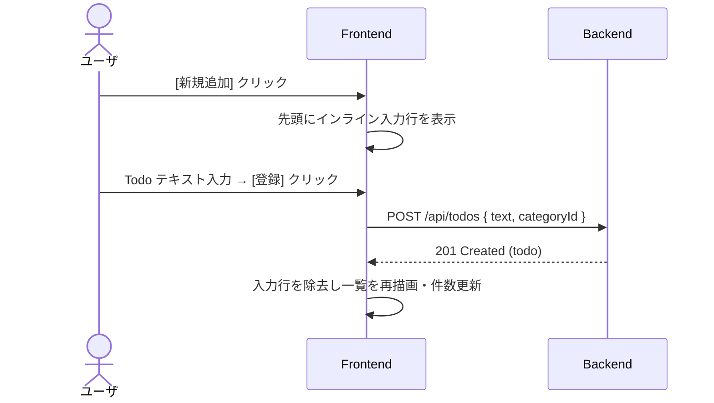
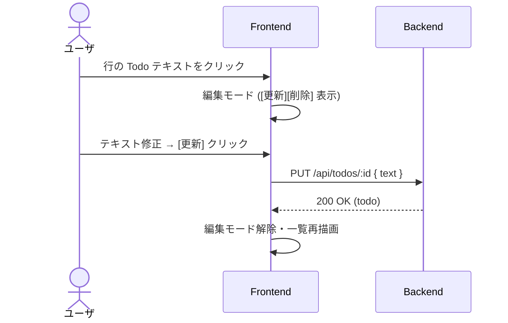
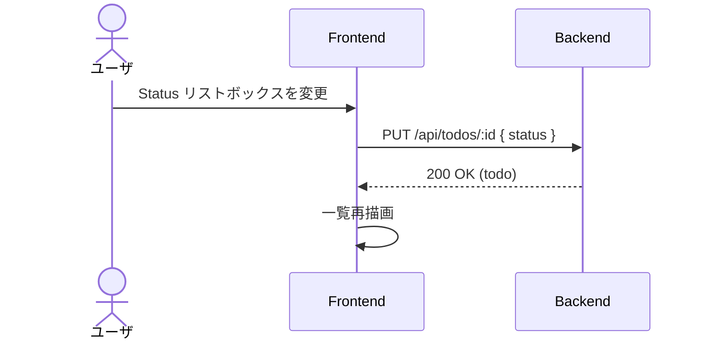
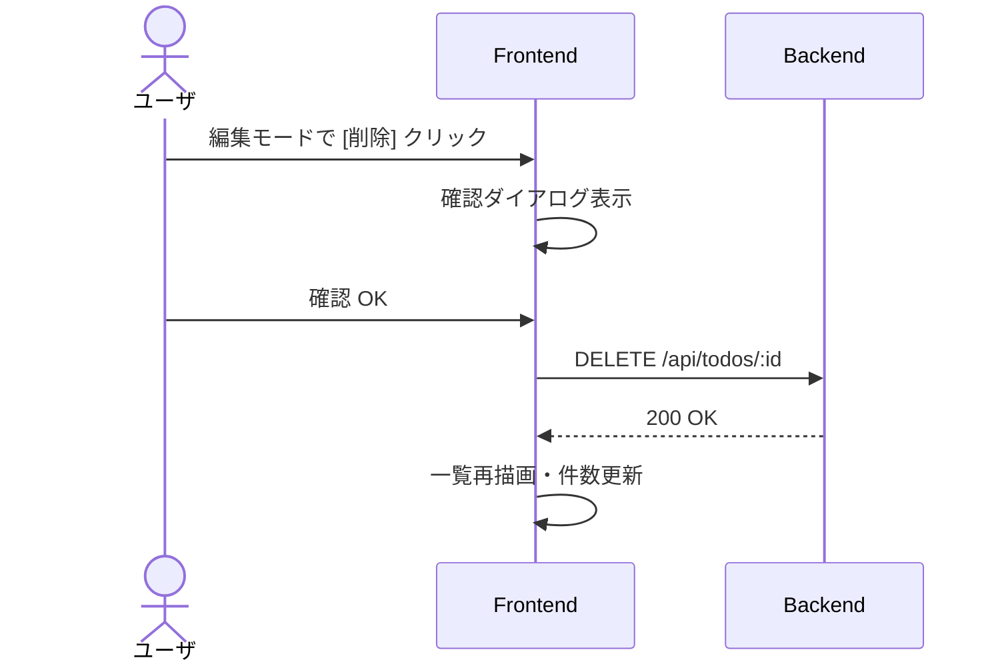
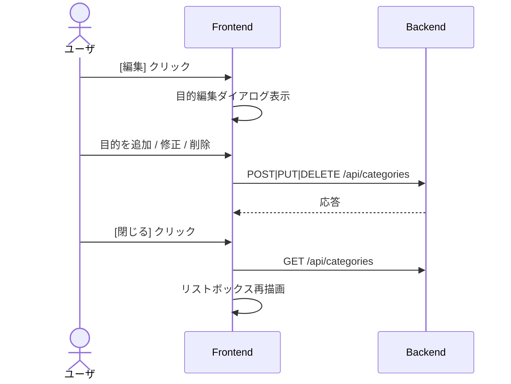

# 画面設計 — メイン一覧画面

> **画面 ID**: S01
> **パス**: `/`
> **対応 US**: US-001, US-002, US-003, US-004, US-005, US-006
> **種別**: SPA 単一画面 (画面遷移なし)

---

## 1. 画面概要

アプリ唯一の画面。「目的 (Category)」を切り替えながら、紐づく Todo を一覧表示・追加・編集・削除する。
ダイアログを除き画面遷移は発生しない (US-001)。

---

## 2. ワイヤーフレーム

```
┌──────────────────────────────────────────────────────────────────┐
│  するリスト                                                      │
├──────────────────────────────────────────────────────────────────┤
│                                                                  │
│  ┌──────────────┐            ┌──────┐         ┌──────────┐      │
│  │ Objective  ▼ │            │ 編集 │         │ 新規追加 │      │
│  └──────────────┘            └──────┘         └──────────┘      │
│                                                                  │
│  ─── Todo 一覧 ─────────────────────────── 2件 ──               │
│                                                                  │
│  ┌────┬──────────┬──────────────────┬────────────┬────────────┐  │
│  │ #  │ Status   │ Todo             │ RegistDate │ UpdateDate │  │
│  ├────┼──────────┼──────────────────┼────────────┼────────────┤  │
│  │ 1  │ [▼ ...] │ ご飯を食べる      │ 2026/5/6   │            │  │
│  │ 2  │ [▼ ...] │ 寝る             │ 2026/5/6   │            │  │
│  └────┴──────────┴──────────────────┴────────────┴────────────┘  │
│                                                                  │
│  ※ 行選択で編集モードに入ると [更新][削除] ボタンが行末に出現     │
│                                                                  │
└──────────────────────────────────────────────────────────────────┘
```

### 2-1. 新規追加行 (インライン)

`[新規追加]` 押下で一覧の先頭に入力行が挿入される。

```
  ┌────┬──────────┬──────────────────────────────────┬──────────┐
  │ -  │          │ [____________________________]   │ [登録]   │
  └────┴──────────┴──────────────────────────────────┴──────────┘
```

### 2-2. 編集モード行

既存 Todo のテキスト部分をクリック/選択すると、その行が編集モードになる。

```
  ┌────┬──────────┬──────────────────┬────────────┬────────────┬──────────────┐
  │ 1  │ [▼ ...] │ [ご飯を食べる___] │ 2026/5/6   │            │ [更新][削除] │
  └────┴──────────┴──────────────────┴────────────┴────────────┴──────────────┘
```

### 2-3. 目的編集ダイアログ (モーダル)

`[編集]` ボタン押下で表示されるモーダルダイアログ。

```
  ┌──────────────────────────────────────┐
  │  目的の管理                           │
  │                                      │
  │  ┌──────────────────────┬─────┬────┐ │
  │  │ 目的名               │ 件数│    │ │
  │  ├──────────────────────┼─────┼────┤ │
  │  │ Objective A          │  5  │ ✕  │ │
  │  │ Objective B [______] │  3  │ ✕  │ │
  │  └──────────────────────┴─────┴────┘ │
  │                                      │
  │  [＋ 追加]                 [閉じる]   │
  └──────────────────────────────────────┘
```

---

## 3. UI 要素仕様

### 3-1. ヘッダ領域

| 要素 | 種別 | 仕様 |
|------|------|------|
| アプリタイトル | テキスト | 「するリスト」固定表示 |

### 3-2. 目的セレクタ領域 (US-002, US-003)

| 要素 | 種別 | 仕様 |
|------|------|------|
| Objective リストボックス | `<select>` | 登録済み目的を一覧表示。選択切替で紐づく Todo を再取得 |
| 編集ボタン | `<button>` | 目的編集ダイアログ (モーダル) を開く |
| 新規追加ボタン | `<button>` | Todo 一覧の先頭にインライン入力行を挿入 |

### 3-3. Todo 一覧テーブル (US-004, US-005)

| 列 | データ | 幅目安 | 備考 |
|----|--------|--------|------|
| # | 連番 (表示用) | 40px | 自動採番 (1-origin) |
| Status | 進捗リストボックス | 140px | 常時変更可能 (US-006)。値変更で即 Update |
| Todo | テキスト | 残り幅 | 全角 40 文字上限 (US-004)。クリックで編集モードへ |
| RegistDate | 登録日時 | 120px | `YYYY/M/D H:mm` 形式。読み取り専用 |
| UpdateDate | 更新日時 | 120px | 同上。未更新時は空欄 |

**件数表示**: テーブル上部に「N件」を表示 (US-005)。

### 3-4. 行操作ボタン

| ボタン | 表示条件 | アクション |
|--------|----------|------------|
| 登録 | 新規追加行のみ | INSERT → 一覧に反映 |
| 更新 | 編集モード時のみ | UPDATE → 一覧に反映 |
| 削除 | 編集モード時のみ | 確認後 DELETE → 一覧から除去 |

> **Excel メモ準拠**: 更新・削除ボタンは普段は非表示。編集モードに入った場合のみ表示。

### 3-5. 目的編集ダイアログ (US-003)

| 要素 | 種別 | 仕様 |
|------|------|------|
| 目的名 | テキスト / 入力欄 | クリックで編集可能 |
| 件数 | テキスト | 紐づく Todo 件数を表示 (読み取り専用) |
| 削除 (✕) | ボタン | 確認ダイアログ後、目的＋紐づく Todo を Cascade 削除 |
| ＋ 追加 | ボタン | 新規目的の入力行を末尾に追加 |
| 閉じる | ボタン | ダイアログを閉じる。リストボックスの選択肢を再取得 |

---

## 4. 進捗ステータス定義 (US-006)

| 値 (DB / API) | 表示ラベル | 意味 |
|----------------|------------|------|
| `Not Started` | Not Started (未着手) | 初期値 |
| `In Progress` | In Progress (進行中) | 作業中 |
| `Pending` | Pending (保留) | 一時停止 |
| `Done` | Done (完了) | 完了済み。編集・削除は引き続き可能 |

---

## 5. 操作フロー

### 5-1. Todo 登録



### 5-2. Todo 編集



### 5-3. ステータス変更



### 5-4. Todo 削除



### 5-5. 目的管理



---

## 6. バリデーション / エラー

| 対象 | ルール | エラー表示 |
|------|--------|------------|
| Todo テキスト | 必須 / 最大 40 文字 (全角換算) | 入力欄下にインラインメッセージ |
| 目的名 | 必須 / 重複不可 | ダイアログ内にインラインメッセージ |
| 目的削除 | 紐づく Todo がある場合は確認ダイアログ | 「N件の Todo も削除されます。よろしいですか?」 |
| Todo 削除 | 常に確認ダイアログ | 「削除してよろしいですか?」 |

---

## 7. トレーサビリティ

| US | 本画面での実現箇所 |
|----|---------------------|
| US-001 | 画面全体: SPA 単一画面構成 |
| US-002 | 3-2: Objective リストボックス |
| US-003 | 3-5: 目的編集ダイアログ |
| US-004 | 3-3 + 3-4: インライン入力行 + 登録ボタン |
| US-005 | 3-3 + 3-4: 一覧テーブル + 件数 + 編集モード + 更新/削除 |
| US-006 | 4: 進捗ステータス定義 (Not Started / In Progress / Pending / Done) |
