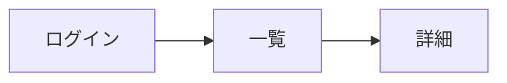

# 画面仕様

> 画面構成・遷移・操作フロー・主要 UI 要素の最新状態を記録する。
> 画面に関する判断は本書を更新してから実装に着手する (`CLAUDE.md` 参照)。

## 1. 画面一覧

| ID | 画面名 | パス | 概要 |
|----|--------|------|------|
| S01 | (例) ログイン | `/login` | (1 行説明) |
| S02 | (例) 一覧 | `/items` |  |

## 2. 画面遷移

(Mermaid / 図 / 文章のいずれかで主要遷移を記述)

## 3. 各画面の仕様

### S01 ログイン

- **目的**:
- **入力項目**:
- **ボタン / アクション**:
- **遷移**:
- **バリデーション / エラー表示**:

### S02 一覧

(同様に記述)

## 4. 共通 UI

- ヘッダ / フッタ
- バッジ / トースト
- モーダル / ポップアップ
- フォーム要素のスタイル統一ルール (デザインシステムの一次正の場所と参照ルール)
