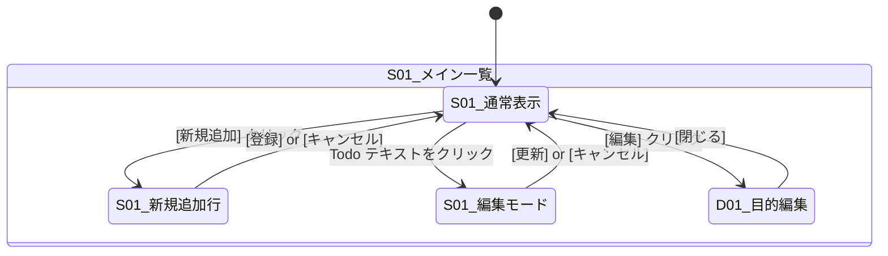

# 画面仕様

> 画面構成・遷移・操作フロー・主要 UI 要素の最新状態を記録する。
> 画面に関する判断は本書を更新してから実装に着手する (`CLAUDE.md` 参照)。
> 各画面の詳細設計は `docs/ui-screens/` に、HTML モックアップは `docs/ui-images/` に格納する。

---

## 1. 画面一覧

| ID | 画面名 | パス | 概要 | 詳細設計 | モックアップ |
|----|--------|------|------|----------|--------------|
| S01 | メイン一覧 | `/` | Todo の表示・追加・編集・削除、目的の切替・管理をすべて行う唯一の画面 | [screen_design.md](ui-screens/screen_design.md) | [main-list.html](ui-images/main-list.html) |
| D01 | 目的編集ダイアログ | (モーダル) | 目的の追加・修正・削除を行うモーダルダイアログ。S01 上に重畳表示 | 同上 | 同上 (View 5) |

---

## 2. 画面遷移

本アプリは SPA 単一画面構成 (US-001)。ルーティングによる画面遷移は存在しない。
画面内の状態遷移 (ビュー切替) のみで全操作を完結させる。

---

## 3. 各画面の仕様

### S01 メイン一覧

- **目的**: Todo の一覧表示・CRUD 操作と、目的 (Category) の切替を行う
- **対応 US**: US-001, US-002, US-004, US-005, US-006

#### 3-1. ヘッダ

| 要素 | 種別 | 仕様 |
|------|------|------|
| アプリタイトル | テキスト | 「するリスト」固定表示。青背景・白文字 |

#### 3-2. ツールバー

| 要素 | 種別 | 仕様 |
|------|------|------|
| Objective リストボックス | `<select>` | 登録済み目的を一覧表示。選択切替で紐づく Todo を再取得・再描画 (US-002) |
| 編集ボタン | `<button>` | 目的編集ダイアログ (D01) を開く (US-003) |
| 新規追加ボタン | `<button>` | Todo 一覧の先頭にインライン入力行を挿入 (US-004) |

#### 3-3. Todo 一覧テーブル

**件数表示**: テーブル上部に「N件」バッジを表示 (US-005)。

| 列 | データ | 幅目安 | 備考 |
|----|--------|--------|------|
| # | 連番 (表示用) | 44px | 自動採番 (1-origin) |
| Status | 進捗リストボックス | 160px | 常時変更可能。値変更で即 PUT 発行 (US-006) |
| Todo | テキスト | 残り幅 | 全角 40 文字上限 (US-004)。クリックで編集モードへ (US-005) |
| RegistDate | 登録日時 | 130px | `YYYY/M/D H:mm` 形式。読み取り専用 |
| UpdateDate | 更新日時 | 130px | 同上。未更新時は空欄 |
| (操作) | ボタン群 | 130px | 状態に応じて表示切替 (下記) |

#### 3-4. 行の状態と操作ボタン

| 状態 | 表示されるボタン | トリガー → アクション |
|------|------------------|----------------------|
| 通常表示 | なし | 行の Todo テキストをクリック → 編集モードへ |
| 新規追加行 | [登録] | [登録] クリック → `POST /api/todos` → 行を除去して一覧再描画 |
| 編集モード | [更新] [削除] | [更新] → `PUT /api/todos/:id` / [削除] → 確認後 `DELETE /api/todos/:id` |

> 更新・削除ボタンは普段は非表示。編集モードに入った場合のみ表示。

#### 3-5. ステータスチップ

| DB 値 | 表示ラベル | チップ色 |
|-------|------------|----------|
| `Not Started` | Not Started (未着手) | グレー |
| `In Progress` | In Progress (進行中) | ブルー |
| `Pending` | Pending (保留) | イエロー |
| `Done` | Done (完了) | グリーン |

Status は完了状態でも Todo の編集・削除を制限しない (US-006)。

#### 3-6. バリデーション / エラー

| 対象 | ルール | エラー表示 |
|------|--------|------------|
| Todo テキスト | 必須 / 最大 40 文字 (全角換算) | 入力欄下にインラインメッセージ |
| Todo 削除 | 常に確認ダイアログ | 「削除してよろしいですか?」 |

---

### D01 目的編集ダイアログ

- **目的**: 目的 (Category) の追加・修正・削除を行う
- **対応 US**: US-003
- **表示方法**: S01 上にオーバーレイ付きモーダルとして重畳表示

#### 要素一覧

| 要素 | 種別 | 仕様 |
|------|------|------|
| ダイアログタイトル | テキスト | 「目的の管理」固定表示 |
| 目的リスト | テーブル | 登録済み目的を一覧表示。各行に目的名・件数・削除ボタン |
| 目的名 | テキスト / 入力欄 | クリックで編集可能。確定時に `PUT /api/categories/:id` |
| 件数 | テキスト | 紐づく Todo 件数を表示 (読み取り専用) |
| 削除 (✕) ボタン | `<button>` | 確認ダイアログ後、`DELETE /api/categories/:id` (Cascade 削除) |
| ＋ 追加ボタン | `<button>` | リスト末尾に入力行を追加。入力確定で `POST /api/categories` |
| 閉じるボタン | `<button>` | ダイアログを閉じる。S01 の Objective リストボックスを再取得して同期 |

#### バリデーション / エラー

| 対象 | ルール | エラー表示 |
|------|--------|------------|
| 目的名 | 必須 / 重複不可 | ダイアログ内にインラインメッセージ |
| 目的削除 | 紐づく Todo がある場合は確認ダイアログ | 「N件の Todo も削除されます。よろしいですか?」 |

---

## 4. 共通 UI

### 4-1. レイアウト

- 最大幅 960px、中央寄せ
- 背景: 薄いブルー (`#f0f6ff`)

### 4-2. デザインシステム

一次正: `frontend/src/styles/app.css`
HTML モックアップの Design Token (`docs/ui-images/main-list.html` の `:root` 変数) を参照元とする。

| トークン | 値 | 用途 |
|----------|----|------|
| `--color-primary` | `#3b82f6` | ボタン・アクセントカラー |
| `--color-bg` | `#f0f6ff` | ページ背景 |
| `--color-surface` | `#ffffff` | カード・テーブル背景 |
| `--color-border` | `#bfdbfe` | ボーダー |
| `--color-header-bg` | `#3b82f6` | ヘッダ背景 |
| `--color-editing-bg` | `#fef9c3` | 編集モード行の背景 |

### 4-3. 共通コンポーネント

| コンポーネント | 用途 |
|----------------|------|
| ヘッダ | アプリタイトル表示 (フッタなし) |
| 確認ダイアログ | 削除操作時の確認用。ブラウザ標準 `confirm()` or カスタムモーダル |
| バッジ | 件数表示 (`N件`) |
| ステータスチップ | 進捗状態の色付きラベル |
